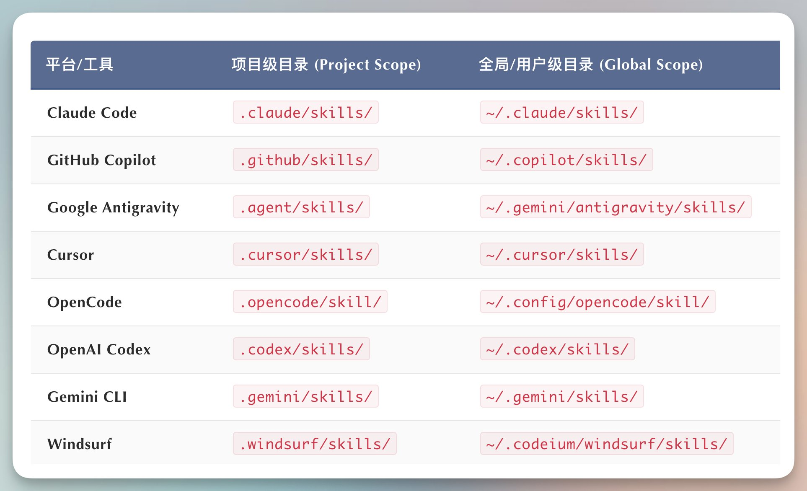
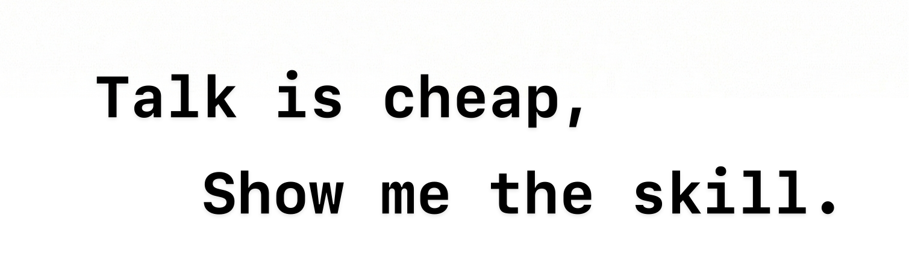

  

    
  

  

    
    
    
  

本项目致力于收集和分享最优质的中文 Agent Skills 教程、案例和实践，欢迎通过 Issues 提交资源参与共建。

> 欢迎关注我的 🐦‍⬛ 账号 [@李不凯正在研究](https://x.com/libukai) ，即时获取 Agent Skills 的最新资讯和实用教程！

## 快速入门

Agent Skills 是一个由 Anthropic 维护的 [开放标准](https://agentskills.io/home)，能便捷地将个人经验转化为 AI Skill，快速构建轻量级的 Personal Agent。

### 喂饭教程

-   [@一泽 Eze：Agent Skills 终极指南：入门、精通、预测](https://mp.weixin.qq.com/s/jUylk813LYbKw0sLiIttTQ)
-   [@数字生命卡兹克：一文带你看懂，火爆全网的 Skills 到底是个啥](https://x.com/Khazix0918/status/2010940910083940382)
-   [@王树义：一篇文章搞懂 AI 怎么从「嘴替」升级成「打工人」](https://x.com/wshuyi/status/2009451186039214388)

### 进阶教程

-   [@宝玉：五步框架把 Workflow 变成可进化的 Skill](https://x.com/dotey/status/2010176124450484638)
-   [@向阳乔木：小白友好的 OpenCode Skill 实操指南](https://x.com/vista8/status/2010540934359097689)
-   [@歸藏：带动效的 PPT 生成 Agent！使用教学&创作思路](https://x.com/op7418/status/2010979152284041401)
-   [@李不凯正在研究：Cherry Studio 中应用 Agent Skills 最佳实践](https://mp.weixin.qq.com/s/nqBMW9QaTcagohzy2gXaZA)

### 深度分析

-   [@凡人小北：中推圈都在教怎么写 Skill，但你可能正在重复 MCP 的错误](https://x.com/frxiaobei/status/2011075599083995566)
-   [@deeptoai：Claude Agent Skills 第一性原理深度解析](https://skills.deeptoai.com/zh/docs/ai-ml/claude-agent-skills-first-principles-deep-dive)
-   [@宝玉：Claude Code 的"懒加载"更新：AI 终于学会了"随叫随到"](https://x.com/dotey/status/2011660434516873264)

## 官方支持

Agent Skills 开放标准已得到 OpenAI/Google/Microsoft/Cursor 等多家 AI 行业领军公司的支持，迅速成为各大主流 AI 编程工具的标配。

安装 Agent Skills，只需要将 Skill 文件夹放入对应的目录即可。也可以使用 Vercel 官方出品的 [add-skill](https://github.com/vercel-labs/add-skill) 工具通过命令行快速添加，如果有多 Coding CLI 同步需求，还可以使用 [runkids/skillshare](https://github.com/runkids/skillshare) 进行统一管理。

### CLI 工具

-   [Anthropic/Claude Code](https://claude.com/skills)： 在 Claude Code 中使用 Skills 的说明文档
-   [OpenAI/Codex](https://developers.openai.com/codex/skills/)： 在 Codex 中使用 Skills 的说明文档
-   [Google/Gemini Cli](https://geminicli.com/docs/cli/skills/)： 在 Gemini Cli 中使用 Skills 的说明文档

### IDE 工具

-   [OpenCode](https://opencode.ai/docs/skills/)：在 OpenCode 中使用 Agent Skills 的说明文档
-   [VS Code](https://code.visualstudio.com/docs/copilot/customization/agent-skills)：在 VS Code 中使用 Agent Skills 的说明文档
-   [Antigravity](https://antigravity.google/docs/skills)：在 Antigravity 中使用 Skills 的说明文档
-   [Cursor](https://cursor.com/cn/docs/context/skills)：在 Cursor 中使用 Agent Skills 的说明文档

## 技能商店

推荐使用 [skillsmp](https://skillsmp.com/zh) 在线商店。该商店中自动抓取了 Github 上的所有的 Skills 项目，并按照分类、更新时间、Star 数量等标签进行了整理。

其他特色 Agent Skills 商店还有：

-   [SkillStore](https://skillstore.io/zh-hans)：对 Skill 进行了安全审计的中文商店
-   [skills.rest](https://skills.rest/)：提供 Skill 评分的 Agent Skills 商店
-   [活水插件](https://42plugin.com/)：中文 Plugin 商店， 包括 Skills 板块

## 精选技能

### 技能创建

-   [anthropics/skill-creator](https://github.com/anthropics/skills/tree/main/skills/skill-creator): Anthropic 官方出品用于创建 skill 的元技能，可快速创建个人专属的 skill

### 文档处理

-   [docx](https://github.com/anthropics/skills/tree/main/skills/docx)：创建、编辑和分析 Word 文档，支持修订、评论、格式保留和文本提取
-   [pdf](https://github.com/anthropics/skills/tree/main/skills/pdf)：全面的 PDF 操作工具包，用于提取文本和表格、创建新 PDF、合并/拆分文档以及处理表单
-   [pptx](https://github.com/anthropics/skills/tree/main/skills/pptx)：创建、编辑和分析 PowerPoint 演示文稿，支持布局、模板、图表和自动幻灯片生成
-   [xlsx](https://github.com/anthropics/skills/tree/main/skills/xlsx)：创建、编辑和分析 Excel 电子表格，支持公式、格式、数据分析和可视化

### 编程辅助

-   [vercel-labs/agent-skills](https://github.com/vercel-labs/agent-skills)：Vercel 官方出品的编程 Skills 集合
-   [obra/superpowers](https://github.com/obra/superpowers/tree/main/skills): 涵盖完整编程项目工作流程的 Skills 集合
-   [ComposioHQ/awesome-claude-skills](https://github.com/ComposioHQ/awesome-claude-skills)：涵盖多个编程类任务的优质 Skills 集合
-   [nextlevelbuilder/ui-ux-pro-max-skill](https://github.com/nextlevelbuilder/ui-ux-pro-max-skill)：面向 UI/UX 设计的 Skills 集合

### 产品使用

-   [langgenius/dify](https://github.com/langgenius/dify/tree/main/.claude/skills)：Dify 官方出品的多功能 Skills 集合
-   [czlonkowski/n8n-skills](https://github.com/czlonkowski/n8n-skills)：创建 n8n 工作流的 Skills 集合
-   [kepano/obsidian-skills](https://github.com/kepano/obsidian-skills)：增强 Obsidian 功能的 Skills 集合
-   [wshuyi/x-article-publisher-skill](https://github.com/wshuyi/x-article-publisher-skill): 发布 X 文章的 Skill
-   [teng-lin/notebooklm-py](https://github.com/teng-lin/notebooklm-py)：操控 NotebookLM 的 Skill
-   [huggingface/skills](https://github.com/huggingface/skills)：使用 Skill 在 HuggingFace 训练大模型

### 其他类型

-   [JimLiu/baoyu-skills](https://github.com/JimLiu/baoyu-skills)：宝玉老师的自用 SKills 集合，包括自动发公众号功能等
-   [huangserva/skill-prompt-generator](https://github.com/huangserva/skill-prompt-generator)：黄佬使用 Skill 生成和优化文生图提示词
-   [op7418/NanoBanana-PPT-Skills)](https://github.com/op7418/NanoBanana-PPT-Skills)：歸藏制作的基于 NanoBanana 生成 PPT 的 Skill
-   [OthmanAdi/planning-with-files](https://github.com/OthmanAdi/planning-with-files)：使用文件规划实现类 Manus 效果的 Skill
-   [anthropics/skills](https://github.com/anthropics/skills)：Anthropic 官方 Skills 集合，适合学习 Skill 优质实例
-   [K-Dense-AI/claude-scientific-skills](https://github.com/K-Dense-AI/claude-scientific-skills)： 面向科研工作者的 Skills 集合

## 配套工具

-   [agent-skills-guard](https://github.com/brucevanfdm/agent-skills-guard)：Agent skills 可视化管理+精选仓库+安全扫描
-   [skillmaster](https://github.com/davidyangcool/agent-skill)：通过终端管理、安装和使用 Agent Skills
-   [Skill_Seekers](https://github.com/yusufkaraaslan/Skill_Seekers): 自动化抓取文档网站、GitHub 仓库和 PDF 文件转换为 Agent Skills

## 待审查资源

> ⚠️ 警告：以下资源尚未经过严格审查，可能存在质量参差不齐的情况。

- [skild.sh](https://skild.sh/)：一个基于命令行的 Agent Skills 安装、管理和发布工具
  
## 权威资料

Anthropic 在官方博客中提供了丰富的 Agent Skills 相关教程，推荐有余力者阅读以下文章以深入了解 Agent Skills 的概念、创建方法和应用场景：

-   [Introducing Agent Skills: Improve how it performs specific tasks](https://claude.com/blog/skills)
-   [Skills explained: How Skills compares to prompts, Projects, MCP, and subagents](https://claude.com/blog/skills-explained)
-   [Extending Claude’s capabilities with skills and MCP servers](https://claude.com/blog/extending-claude-capabilities-with-skills-mcp-servers)
-   [Equipping agents for the real world with Agent Skills](https://www.anthropic.com/engineering/equipping-agents-for-the-real-world-with-agent-skills)
-   [How to create Skills: Key steps, limitations, and examples](https://claude.com/blog/how-to-create-skills-key-steps-limitations-and-examples)
-   [Building Skills for Claude Code: Automating your procedural knowledge](https://claude.com/blog/building-skills-for-claude-code)
-   [https://www.anthropic.com/engineering/code-execution-with-mcp](https://www.anthropic.com/engineering/code-execution-with-mcp)
-   [Improving frontend design through Skills](https://claude.com/blog/improving-frontend-design-through-skills#real-world-skills-examples)
-   [Don't Build Agents, Build Skills Instead](https://x.com/iamzhihui/status/2005883147305500681/photo/1)

## 致谢

