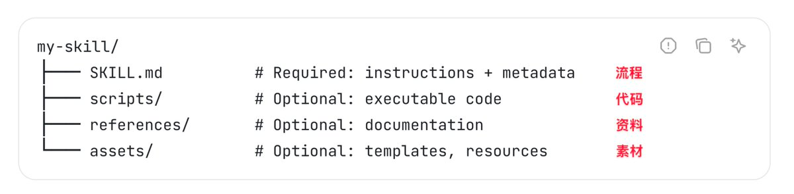

  

    
  

  

    
    
    
  

简体中文 | [English](README_EN.md) | [日本語](README_JA.md) 

本项目致力于遵守少而精的原则，收集和分享最优质的 Skills 教程、案例和实践，帮助更多人轻松迈出搭建 Agent 的第一步。

> 欢迎关注我的 𝕏 账号 [@李不凯正在研究](https://x.com/libukai) ，即时获取 Agent Skills 的最新资源和实战教程！

## 快速入门

Agent Skills 是一个由 Anthropic 牵头维护的 [开放标准](https://agentskills.io/home)，通过定义特定任务执行规范，能便捷地将个人经验转化为技能，快速构建轻量级的智能体。

该标准目前已得到 Anthropic/OpenAI/Google/Microsoft/Cursor 等多家行业领军公司的支持，迅速成为各大主流 AI 工具的标配。

根据标准定义，每个 Skill 都是一个规范化命名的文件夹，其中组合了 Markdown 文档、可执行脚本和其他类型素材文件。

## 教程合集

### 图文教程

-   [@一泽 Eze：Agent Skills 终极指南：入门、精通、预测](https://mp.weixin.qq.com/s/jUylk813LYbKw0sLiIttTQ)
-   [@deeptoai：Claude Agent Skills 第一性原理深度解析](https://skills.deeptoai.com/zh/docs/ai-ml/claude-agent-skills-first-principles-deep-dive)
-   [@歸藏：带动效的 PPT 生成 Agent！使用教学&创作思路](https://x.com/op7418/status/2010979152284041401)

### 视频教程

-   [@马克的技术工作坊：Agent Skill 从使用到原理，一次讲清](https://www.youtube.com/watch?v=yDc0_8emz7M)
-   [@白白说大模型：别再造 Agent 了，未来是Skills的](https://www.youtube.com/watch?v=xeoWgfkxADI)
-   [@01Coder：OpenCode + 智谱GLM + Agent Skills打造高质量智能开发环境](https://www.youtube.com/watch?v=mGzY2bCoVhU)

## 技能商店

推荐使用 Vercel 出品的 [skills.sh](https://skills.sh/) 排行榜，可以直观查看当前最受欢迎的 Skills 仓库和单个 Skill 的使用情况。

还可以辅助使用 [skillsmp](https://skillsmp.com/zh) 商店，该商店中自动抓取了 Github 上的所有的 Skills 项目，并按照分类、更新时间、Star 数量等标签进行了整理。

其他特色 Agent Skills 商店还有：

-   [context7](https://context7.com/?tab=skills)：基于 Context7 的 Skill 商店
-   [skillstore.io](https://skillstore.io/zh-hans)：对 Skill 进行了安全审计的中文商店
-   [agentskills.me](https://agentskills.me/)：提供了云端 Skill 运行环境的商店
-   [skills.rest](https://skills.rest/)：提供 Skill 分析和安全审查的商店

## 产品使用

Agent Skills 作为一套基于文件系统的跨平台标准，可以灵活地被嵌入到各种产品中使用。

目前越来越多的编程工具和对话工具已经开始支持 Agent Skills 标准，相信后续还会有更多形式的使用方式出现。

### 编程工具

要在编程工具中安装 Agent Skills，只需要将 Skill 文件夹放入对应的路径即可。

建议使用 Vercel 官方出品的 `npx skills add <owner/repo>` 命令行工具快速发现和添加 skill，具体参数详见 [npmjs/skills](https://www.npmjs.com/package/skills)。

| 工具              | 项目路径             | 全局路径                        | 官方文档                                                                                    |
| ----------------- | -------------------- | ------------------------------- | ------------------------------------------------------------------------------------------- |
| **Amp**           | `.agents/skills/`    | `~/.config/agents/skills/`      | [Amp Skills](https://ampcode.com/manual#agent-skills)                                       |
| **Antigravity**   | `.agent/skills/`     | `~/.gemini/antigravity/skills/` | [Antigravity Skills](https://antigravity.google/docs/skills)                                |
| **Claude Code**   | `.claude/skills/`    | `~/.claude/skills/`             | [Claude Code Skills](https://code.claude.com/docs/en/skills)                                |
| **Codex**         | `.codex/skills/`     | `~/.codex/skills/`              | [Codex Skills](https://developers.openai.com/codex/skills)                                  |
| **Cursor**        | `.cursor/skills/`    | `~/.cursor/skills/`             | [Cursor Skills](https://cursor.com/cn/docs/context/skills)                                  |
| **CodeBuddy**     | `.codebuddy/skills/` | `~/.codebuddy/skills/`          | [Codebuddy Skills](https://copilot.tencent.com/docs/cli/skills)                             |
| **Droid/Factory** | `.factory/skills/`   | `~/.factory/skills/`            | [Factory Droid Skills](https://docs.factory.ai/cli/configuration/skills)                    |
| **Gemini CLI**    | `.gemini/skills/`    | `~/.gemini/skills/`             | [Gemini CLI Skills](https://geminicli.com/docs/cli/skills/)                                 |
| **Goose**         | `.goose/skills/`     | `~/.config/goose/skills/`       | [Goose Skills](https://block.github.io/goose/docs/guides/context-engineering/using-skills/) |
| **Kilo Code**     | `.kilocode/skills/`  | `~/.kilocode/skills/`           | [Kilo Skills](https://kilo.ai/docs/agent-behavior/skills)                                   |
| **Kimi CLI**      | `.kimi/skills/`      | `~/.kimi/skills`                | [Kimi CLI Skills](https://moonshotai.github.io/kimi-cli/zh/customization/skills.html)       |
| **OpenCode**      | `.opencode/skills/`  | `~/.config/opencode/skills/`    | [OpenCode Skills](https://opencode.ai/docs/skills)                                          |
| **Qwen Code**     | `.qwen/skills/`      | `~/.qwen/skills/`               | [Qwen Code Skills](https://qwenlm.github.io/qwen-code-docs/zh/users/features/skills/)       |
| **Roo Code**      | `.roo/skills/`       | `~/.roo/skills/`                | [Roo Code Skills](https://docs.roocode.com/features/skills)                                 |
| **Trae**          | `.trae/skills/`      | ---                             | [Trae Skills](https://docs.trae.ai/ide/skills?_lang=zh)                                     |
| **VS Code**       | `.github/skills/`    | `~/.copilot/skills/`            | [VS Code Skills](https://code.visualstudio.com/docs/copilot/customization/agent-skills)     |
| **Windsurf**      | `.windsurf/skills/`  | `~/.codeium/windsurf/skills/`   | [Windsurf Skills](https://docs.windsurf.com/windsurf/cascade/skills)                        |

### 对话工具

随着 Agent Skills 标准的普及，越来越多的对话式 AI 工具也开始支持 Skill 的安装和使用。

用户可以通过添加 Skill 来扩展助手/智能体的能力，实现更复杂的任务处理流程。

-   [Coze/扣子](https://www.coze.cn/open/docs/cozespace/what_is_skill)： Coze 2.0 新增技能功能使用说明
-   [Cherry Studio](https://mp.weixin.qq.com/s/nqBMW9QaTcagohzy2gXaZA)：在 Cherry Studio 中通过 Agent 使用 Skill 最佳实践

## 精选技能

### 技能创建

-   [anthropics/skill-creator](https://github.com/anthropics/skills/tree/main/skills/skill-creator): Anthropic 官方出品用于创建 skill 的元技能，可快速创建和迭代个人专属的 skill
-   [yusufkaraaslan/Skill_Seekers](https://github.com/yusufkaraaslan/Skill_Seekers): 自动化抓取文档网站、GitHub 仓库和 PDF 文件转换为 Agent Skills

### 文档处理

-   [docx](https://github.com/anthropics/skills/tree/main/skills/docx)：创建和编辑 Word 文档的 Skill
-   [pptx](https://github.com/anthropics/skills/tree/main/skills/pptx)：创建和编辑 PowerPoint 的 Skill
-   [xlsx](https://github.com/anthropics/skills/tree/main/skills/xlsx)：创建和编辑 Excel 的 Skill
-   [pdf](https://github.com/anthropics/skills/tree/main/skills/pdf)：创建和编辑 PDF 的 Skill

-   [RioTheGreat-ai/agentfund-skill](https://github.com/RioTheGreat-ai/agentfund-skill): Crowdfunding for AI agents with milestone-based escrow on Base
### 官方项目

-   [anthropics/skills](https://github.com/anthropics/skills)：Anthropic 出品的 Skills 集合
-   [better-auth/skills](https://github.com/better-auth/skills)：Better Auth 出品的认证工具 Skills 集合
-   [black-forest-labs/skills](https://github.com/black-forest-labs/skills)：Black Forest Labs 出品的操控 FLUX 模型的 Skills 集合
-   [expo/skills](https://github.com/expo/skills)：Expo 出品的 React Native Skills 集合
-   [huggingface/skills](https://github.com/huggingface/skills)：HuggingFace 出品使用 Skill 训练大模型
-   [kepano/obsidian-skills](https://github.com/kepano/obsidian-skills)：Obsidian CEO 出品增强 Obsidian 功能的 Skills 集合
-   [langgenius/dify](https://github.com/langgenius/dify/tree/main/.claude/skills)：Dify 出品的多功能 Skills 集合
-   [microsoft/agent-skills](https://github.com/microsoft/agent-skills)：Microsoft 出品用于 Azure 服务的 Agent Skills 集合
-   [remotion-dev/skills](https://github.com/remotion-dev/skills)：Remotion 出品的使用 Remotion 创建视频内容
-   [google-labs-code/stitch-skills](https://github.com/google-labs-code/stitch-skills)：Google Labs 出品的 Stitch Skills 集合
-   [stripe/ai](https://github.com/stripe/ai): Stripe 出品的金融支付相关 Skills 集合
-   [sanity-io/agent-toolkit](https://github.com/sanity-io/agent-toolkit/tree/main/skills)：Sanity 出品的内容管理平台 Skills 集合
-   [supabase/agent-skills](https://github.com/supabase/agent-skills)：Supabase 出品的 PostgreSQL 最佳实践
-   [vercel-labs/agent-skills](https://github.com/vercel-labs/agent-skills)：Vercel 出品的 React/Next Skills 集合

### 内容创作

-   [JimLiu/baoyu-skills](https://github.com/JimLiu/baoyu-skills)：宝玉的自用 SKills 集合，包括公众号写作、PPT 制作等
-   [github.com/op7418)](https://github.com/op7418?tab=repositories)：歸藏制作的一系列 Skills 集合，包括 PPT 制作、Youtube 分析等
-   [wshuyi/x-article-publisher-skill](https://github.com/wshuyi/x-article-publisher-skill): 王树义发布 X 文章的 Skill
-   [huangserva/skill-prompt-generator](https://github.com/huangserva/skill-prompt-generator)：huangserva 使用 Skill 生成和优化 AI 人像文生图提示词的 Skill

### 编程辅助

-   [obra/superpowers](https://github.com/obra/superpowers/tree/main/skills)：涵盖完整编程项目工作流程的 Skills 集合
-   [ComposioHQ/awesome-claude-skills](https://github.com/ComposioHQ/awesome-claude-skills)：涵盖多个编程类任务的优质 Skills 集合
-   [nextlevelbuilder/ui-ux-pro-max-skill](https://github.com/nextlevelbuilder/ui-ux-pro-max-skill)：面向 UI/UX 设计的 Skills 集合
-   [OthmanAdi/planning-with-files](https://github.com/OthmanAdi/planning-with-files)：使用文件规划实现长期 Plan 效果的 Skill
-   [hyf0/vue-skills](https://github.com/hyf0/vue-skills)：面向 Vue.js 开发的 Skills 集合

### 产品使用

-   [teng-lin/notebooklm-py](https://github.com/teng-lin/notebooklm-py)：操控 NotebookLM 的 Skill
-   [czlonkowski/n8n-skills](https://github.com/czlonkowski/n8n-skills)：创建 n8n 工作流的 Skills 集合
-   [cloudai-x/threejs-skills](https://github.com/cloudai-x/threejs-skills)： 面向 Three.js 开发的 Skills 集合

### 其他类型

-   [coreyhaines31/marketingskills](https://github.com/coreyhaines31/marketingskills)：面向市场营销领域的 Skills 集合
-   [K-Dense-AI/claude-scientific-skills](https://github.com/K-Dense-AI/claude-scientific-skills)： 面向科研工作者的 Skills 集合

## 配套工具

-   [context7 cli](https://context7.com/docs/skills#skills)：使用 context7 cli 命令行工具管理和使用 Agent Skills
-   [openskills](https://github.com/numman-ali/openskills): Skills 全局加载工具，支持多种 Agent 工具
-   [skild.sh](https://skild.sh/)：在多个工具中安装、管理和同步 Skills 的命令行工具
-   [agent-skills-guard](https://github.com/brucevanfdm/agent-skills-guard)：Agent skills 可视化管理+精选仓库+安全扫描
-   [skillmaster](https://github.com/davidyangcool/agent-skill)：通过终端管理、安装和使用 Agent Skills
  
## 权威资料

Anthropic 在官方博客中提供了丰富的 Agent Skills 相关教程，推荐有余力者阅读以下文章以深入了解 Agent Skills 的概念、创建方法和应用场景：

-   [Introducing Agent Skills: Improve how it performs specific tasks](https://claude.com/blog/skills)
-   [Skills explained: How Skills compares to prompts, Projects, MCP, and subagents](https://claude.com/blog/skills-explained)
-   [Extending Claude’s capabilities with skills and MCP servers](https://claude.com/blog/extending-claude-capabilities-with-skills-mcp-servers)
-   [Equipping agents for the real world with Agent Skills](https://www.anthropic.com/engineering/equipping-agents-for-the-real-world-with-agent-skills)
-   [How to create Skills: Key steps, limitations, and examples](https://claude.com/blog/how-to-create-skills-key-steps-limitations-and-examples)
-   [Building Skills for Claude Code: Automating your procedural knowledge](https://claude.com/blog/building-skills-for-claude-code)
-   [Code execution with MCP: Building more efficient agents](https://www.anthropic.com/engineering/code-execution-with-mcp)
-   [Improving frontend design through Skills](https://claude.com/blog/improving-frontend-design-through-skills#real-world-skills-examples)
-   [Don't Build Agents, Build Skills Instead](https://x.com/iamzhihui/status/2005883147305500681/photo/1)

## 致谢

## 项目历史

